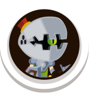

# Kampf der Helden

## Einführung

Eine Gruppe begeisterter Fans von Rollenspielen (*Role Playing Games*, kurz *RPG*) hat Sie gebeten, einen *Battle Simulator* für sie zu bauen. Der Simulator hilft bei der Auswertung von Kämpfen, wenn sich zwei Gegner gegenüberstehen.

Ihr Simulator muss die folgenden Charakterrollen unterstützen:

| Rollenname       | Bild                                          | Beschreibung                                                   |
| ---------------- | --------------------------------------------- | -------------------------------------------------------------- |
| 🏴‍☠️ Pirat         |          | Furchtloser Kämpfer mit guter Stärke und Rüstung               |
| 🪨 Steinkauer     |    | Langsam, aber sehr stark und unempfindlich gegen Angriffe      |
| 👻 Geisterkrieger |   | Schneller Krieger, schwer zu überwinden                        |
| 🦸‍♀️ Außenweltler   |      | Kann nur geringen Schaden anrichten, ist aber superschnell     |
| ⚔️ Monsterritter  |  | Gut ausbalancierter Krieger mit anständiger Stärke und Rüstung |
| 👺 Dunkler Kobold |     | Nicht sehr stark, aber mit schwerer, magischer Rüstung         |

Die folgenden Eigenschaften jedes Charakters definieren seine Stärke im Kampf:

| Eigenschaft             | Beschreibung                                                                             |
| ----------------------- | ---------------------------------------------------------------------------------------- |
| Gesundheit (Health)     | Anzahl der Gesundheitspunkte. Wenn dieser Wert Null erreicht, ist der Charakter besiegt. |
| Angriff (Attack)        | Angriffsstärke in Punkten                                                                |
| Rüstung (Armor)         | Rüstungsstärke in Punkten                                                                |
| Geschwindigkeit (Speed) | Geschwindigkeitsfaktor. Bestimmt die Anzahl der Angriffe pro Runde                       |

Hier sind die Eigenschaftswerte jeder Charakterrolle:

| Rolle          | Attributwerte                                               |
| -------------- | ----------------------------------------------------------- |
| Pirat          | Gesundheit: 20, Angriff: 3, Rüstung: 3, Geschwindigkeit: 3  |
| Steinkauer     | Gesundheit: 50, Angriff: 8, Rüstung: 10, Geschwindigkeit: 1 |
| Geisterkrieger | Gesundheit: 20, Angriff: 2, Rüstung: 2, Geschwindigkeit: 5  |
| Außenweltler   | Gesundheit: 15, Angriff: 1, Rüstung: 2, Geschwindigkeit: 10 |
| Monsterritter  | Gesundheit: 15, Angriff: 4, Rüstung: 3, Geschwindigkeit: 3  |
| Dunkler Kobold | Gesundheit: 10, Angriff: 1, Rüstung: 8, Geschwindigkeit: 3  |

## Kampfregeln

* Kämpfe finden zwischen zwei Charakteren statt.
* Kämpfe finden in Runden statt.
* In jeder Runde können beide Charaktere mehrmals angreifen. Die Anzahl der Angriffe wird durch das Geschwindigkeitsattribut bestimmt. Ein Charakter mit Geschwindigkeit 1 kann einmal pro Runde treffen, einer mit Geschwindigkeit 2 kann zweimal treffen usw.
* Wenn ein Charakter trifft, werden die Punkte von der Rüstung und den Gesundheitspunkten des Gegners basierend auf dem Angriffsattribut des Angreifers reduziert.
  * Zuerst wird das Rüstungsattribut des Gegners reduziert, bis es Null erreicht. Die Rüstung regeneriert sich *nicht* von Rund zu Runde. Ist sie auf Null, bleibt sie auf Null.
  * Die verbleibenden Angriffspunkte werden von den Gesundheitspunkten des Gegners abgezogen, bis sie Null erreichen.
* Am Ende jeder Runde prüft der Simulator, ob es einen Gewinner gibt:
  * Wenn *ein* Charakter Null Gesundheitspunkte erreicht hat, ist der andere Charakter der Gewinner.
  * Wenn *beide* Charaktere am Ende einer Runde Null Gesundheitspunkte erreicht haben, gilt der Kampf als unentschieden.

## Stufe 0

Implementieren Sie eine **vereinfachte** Version der Kampfsimulation. In einer echten Prüfung müssten Sie diese Stufe lösen, um eine positive Note zu erreichen.

* Fragen Sie den Benutzer nach den Charakterrollen der Kämpfer.
  * **Implementieren Sie Pirat, Steinkauer und Geisterkrieger.** Ignorieren Sie die anderen Rollen vorerst.
* Simulieren Sie Kampfrunden, bis es einen Sieger gibt oder der Kampf unentschieden endet.
  * **Ignoriere das Rüstungsattribut (*Armor*) in diesem Level**. Angriffspunkte werden sofort vom Gesundheitsattribut des Gegners abgezogen.
* Zeigen Sie am Ende des Kampfes das Kampfergebnis an.

Hier ist ein Beispiel für eine Kampfberechnung zwischen einem Steinkauer (Spieler 1) und einem Geisterkrieger (Spieler 2):

| Runde | Zeichen        | Anfang der Gesundheit | Angriff des Gegners | Gesundheit Ende |
| ----: | -------------- | --------------------: | ------------------- | --------------: |
|     1 | Steinkauer     |                    50 | 5 * 2 = 10          |              40 |
|     1 | Geisterkrieger |                    20 | 1 * 8 = 8           |              12 |
|     2 | Steinkauer     |                    40 | 5 * 2 = 10          |              30 |
|     2 | Geisterkrieger |                    12 | 1 * 8 = 8           |               4 |
|     3 | Steinkauer     |                    30 | 5 * 2 = 10          |              20 |
|     3 | Geisterkrieger |                     4 | 1 * 8 = 8           |               0 |

Steinkauer (Spieler 1) hat nach 3 Runden gewonnen.

## Level 1

Vervollständigen Sie die Kampfsimulation:

* Gleiche Anforderungen wie Stufe 0.
* Berücksichtigen Sie außerdem das Rüstungsattribut in der Kampfsimulation.
* Implementieren Sie zusätzlich alle Charakterrollen.

Hier ist ein Beispiel für eine Kampfberechnung zwischen einem Steinkauer (Spieler 1) und einem Geisterkrieger (Spieler 2):

| Runde | Zeichen        | Anfang der Gesundheit | Rüstung Anfang | Angriff des Gegners | Rüstungsende | Gesundheit Ende |
| ----: | -------------- | --------------------: | -------------: | ------------------- | -----------: | --------------: |
|     1 | Steinkauer     |                    50 |             10 | 5 * 2 = 10          |            0 |              50 |
|     1 | Geisterkrieger |                    20 |              2 | 1 * 8 = 8           |            0 |              14 |
|     2 | Steinkauer     |                    50 |              0 | 5 * 2 = 10          |            0 |              40 |
|     2 | Geisterkrieger |                    14 |              0 | 1 * 8 = 8           |            0 |               6 |
|     3 | Steinkauer     |                    40 |              0 | 5 * 2 = 10          |            0 |              30 |
|     3 | Geisterkrieger |                     6 |              0 | 1 * 8 = 8           |            0 |               0 |

Steinkauer (Spieler 1) hat nach 3 Runden gewonnen.

## Level 2

Fügen Sie dem Kampf ein gewisses Maß an Zufälligkeit hinzu. Wenn Sie alles einschließlich dieses Levels lösen, würden Sie in einer echten Prüfung eine 1 erhalten.

* Gleiche Anforderungen wie Stufe 1.
* Ändern Sie außerdem die Angriffsstärke jedes Angriffs um einen zufälligen Faktor zwischen -15 % und +15 %.
  * **Beachten Sie, dass Sie in diesem Level Berechnungen mit Fließkommawerten anstelle von Ganzzahlen durchführen müssen**

## Stufe 3

Dies ist eine Bonusübung für Schüler, die eine zusätzliche Herausforderung brauchen.

* Bestimmen Sie basierend auf dem für Level 2 geschriebenen Code, wer der beste Charakter ist, indem Sie 10.000 Kämpfe spielen, jeweils zwischen zwei verschiedenen, zufälligen Charakterrollen. Zählen Sie, wie viele Schlachten jede Charakterrolle gewinnt. Geben Sie am Ende der Simulation aus, welche Charakterrolle wie viele Schlachten gewonnen hat. Spoiler-Alarm: Stone Chewer ist die stärkste Charakterrolle, Dark Goblin die schwächste.
* Immer noch nicht genug? Drucken Sie aus, welche Charakterrolle die meisten Kämpfe gewonnen hat, dh die stärkste ist.
