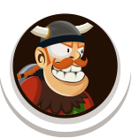

# Battle of Heroes

## Introduction

A group of enthusiastic *Role Playing Game* (RPG) fans asked you to build a battle simulator for them. The simulator helps to resolve battles when two opponents face each other.

You simulator must support the following character roles:

| Role name        | Image                                         | Description                                          |
| ---------------- | --------------------------------------------- | ---------------------------------------------------- |
| 🏴‍☠️ Pirate        |          | Fearless fighter with good strength and armor        |
| 🪨 Stone Chewer   |    | Slow, but very strong and impervious against attacks |
| 👻 Ghost Warrior  |   | Fast warrior, hard to overcome                       |
| 🦸‍♀️ Outworlder     |      | Can only inflict minor damage, but is super fast     |
| ⚔️ Monster Knight |  | Well-balanced warrior with decent strength and armor |
| 👺 Dark Goblin    |     | Not very strong, but with heavy magical armor        |

The following properties of each character define its power in fights:

| Property | Description                                                                     |
| -------- | ------------------------------------------------------------------------------- |
| Health   | Number of health points. If this value reaches zero, the character is defeated. |
| Attack   | Attack strength in points                                                       |
| Armor    | Armor strength in points                                                        |
| Speed    | Speed factor. Determines the number of strikes per round                        |

Here are the attributes of each character role:

| Role           | Attribute values                           |
| -------------- | ------------------------------------------ |
| Pirate         | Health: 20, attack: 3, armor: 3, speed: 3  |
| Stone Chewer   | Health: 50, attack: 8, armor: 10, speed: 1 |
| Ghost Warrior  | Health: 20, attack: 2, armor: 2, speed: 5  |
| Outworlder     | Health: 15, attack: 1, armor: 2, speed: 10 |
| Monster Knight | Health: 15, attack: 4, armor: 3, speed: 3  |
| Dark Goblin    | Health: 10, attack: 1, armor: 8, speed: 3  |

## Battle Rules

* Battles take place between two characters.
* Battles happen in rounds.
* In each round, both characters can hit a number of times. The number of hits is determined by the speed attribute. A character with speed 1 can hit one time per round, one with speed 2 can hit two times, etc.
* When a character hits, points are reduced from the opponent's armor and health points based on the attackers attack attribute.
  * First, the armor attribute of the opponent is reduced until it reaches zero. The armor does *not* regenerate from round to round. When the armor strength has reached zero, it stays on zero.
  * The remaining attack points are subtracted from the opponent's health points until it reaches zero.
* At the end of each round, the simulator checks if there is a winner:
  * If *one* character has reached zero health points, the other character is the winner.
  * If *both* characters have reached zero health points at the end of a round, the battle is considered a draw.

## Level 0

Implement a **simplified** version of the battle simulation. In a real exam, you would have to solve this level to achieve a positive grade.

* Ask the user for the character roles of the fighters.
  * **Just implement pirate, stone chewer, and ghost warrior.** Ignore the other roles for now.
* Simulate fighting rounds until there is a winner or the battle is a draw.
  * **Ignore the armor attribute in this level**. Attack points are immediately subtracted from the opponents health attribute.
* At the end of the battle, display the battle result.

Here is an example for a battle calculation between a Stone Chewer (player 1) and a Ghost Warrior (player 2):

| Round | Character     | Health beginning | Attack by opponent | Health end |
| ----: | ------------- | ---------------: | ------------------ | ---------: |
|     1 | Stone Chewer  |               50 | 5 * 2 = 10         |         40 |
|     1 | Ghost Warrior |               20 | 1 * 8 = 8          |         12 |
|     2 | Stone Chewer  |               40 | 5 * 2 = 10         |         30 |
|     2 | Ghost Warrior |               12 | 1 * 8 = 8          |          4 |
|     3 | Stone Chewer  |               30 | 5 * 2 = 10         |         20 |
|     3 | Ghost Warrior |                4 | 1 * 8 = 8          |          0 |

Stone Chewer (player 1) has won after 3 rounds.

## Level 1

Complete the battle simulation:

* Same requirements as level 0.
* Additionally, consider the armor attribute in battle simulation
* Additionally, implement all character roles.

Here is an example for a battle calculation between a Stone Chewer (player 1) and a Ghost Warrior (player 2):

| Round | Character     | Health beginning | Armor beginning | Attack by opponent | Armor end | Health end |
| ----: | ------------- | ---------------: | --------------: | ------------------ | --------: | ---------: |
|     1 | Stone Chewer  |               50 |              10 | 5 * 2 = 10         |         0 |         50 |
|     1 | Ghost Warrior |               20 |               2 | 1 * 8 = 8          |         0 |         14 |
|     2 | Stone Chewer  |               50 |               0 | 5 * 2 = 10         |         0 |         40 |
|     2 | Ghost Warrior |               14 |               0 | 1 * 8 = 8          |         0 |          6 |
|     3 | Stone Chewer  |               40 |               0 | 5 * 2 = 10         |         0 |         30 |
|     3 | Ghost Warrior |                6 |               0 | 1 * 8 = 8          |         0 |          0 |

Stone Chewer (player 1) has won after 3 rounds.

## Level 2

Add some level of randomness to the battle. If you solve everything including this level, you would get a 1 in a real exam.

* Same requirements as level 1.
* Additionally, change the attack strength of each strike by a random factor between -15% to +15%.
  * **Note that you must do calculations using floating point values instead of integer values in this level**

## Level 3

This is a bonus exercise for students who need some extra challenge.

* Based on the code written for level 2, determine who is the best character by playing 10,000 battles, each between two different, random character roles. Count how many battles each character role wins. At the end of the simulation, print out which character role won how many battles. Spoiler alert: Stone Chewer is the strongest character role, Dark Goblin the weakest one.
* Still not enough? Print out which character role has won the most battles, i.e. is the strongest one.
