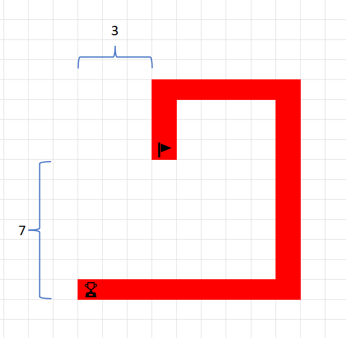

# Geo Caching

## Introduction

You regularly participate in a particular type of [Geocaching](https://en.wikipedia.org/wiki/Geocaching) challenge. In those challenges, you start at a particular point and you get a list of movements like the followings:

* Go 3km to the north.
* Then, go 5km to the east.
* Then, go 10km to the south.
* Then, go 8km to the west.

At the end of this journey, you will find a "treasure".

You recognize that the creators of the Geocaching challenge have made a mistake by giving you all the movements at the beginning. You can simply calculate the end point and go directly to it without actually doing all the movements.

## Functional Requirements

* In a loop, ask the user for movements.
  * First, the user enters the direction (*n* for North, *e* for East, *s* for South, or *w* for West)
  * Next, the user enters the distance in kilometers (e.g. *3* for 3km). The distance is always a positive integer number.

* The user enters *q* (for *quit*) when asked for the direction if she has entered all movements.

* Once the user has entered *q*, print out how much kilometers north/south and east/west the user has to go to reach the end point.
  * Assumption: Users can only go North, South, East, and West. They *cannot*  walk in diagonals.
  * Example output: *You have to go 7km south and 3km west to find the "treasure"*.

## Additional Challenges

* Work with floating-point numbers instead of integers.

* If the user enters an invalid value (e.g. direction *x*, negative distance), print an error message and keep asking for a correct input until you get one.

* Calculate and print who much walking the user saved by going directly to the destination instead of walking all the movements.

## Example

Movements:

* 3km north
* 5km east
* 10km south
  * The user is now 7km south of the starting point.
* 8km west
  * The user is now 3km west of the starting point.

The user has to go 7km south and 3km west to find the "treasure". Here is an illustration showing how the result is calculated:

By going directly to the "treasure" (10 km from start), the user has to walk 16km less than if he had walked all movements (total distance of 26km).
