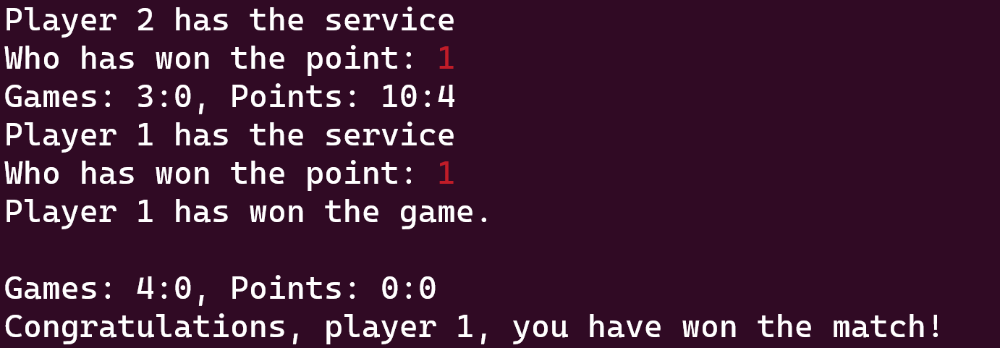

# Ping Pong Counter

## Einleitung

Ein Tischtennisverein (aka Ping Pong) ist auf Sie zugekommen und hat Sie gebeten, eine Zähl-App zu erstellen. Sie soll den SchiedsrichterInnen das Zählen während der Spiele erleichtern. Nach jedem Punkt trägt ein/e SchiedsrichterIn in deiner App ein, welche/r SpielerIn den Punkt erzielt hat. Die App zählt die Punkte und benachrichtigt den/die SchiedsrichterIn, wenn ein Satz oder wenn das Match gewonnen wurden.

In unserer Zähl-App heißt der/die SpielerIn, der/die den ersten Aufschlag hat, *Player 1*. Der/die andere SpielerIn heißt *Player 2*.

Hinweis: Die Zählregeln im echten Tischtennis sind komplexer. In dieser Prüfung implementieren wir ein vereinfachtes Zählsystem (z. B. kein *Gleichstand*).

## Funktionale Anforderungen

### Mindestanforderungen

Folgende Anforderungen müssen Sie umsetzen, um eine positive Note zu erreichen.

* Fragen Sie den/die SchiedsrichterIn, welcher Spieltyp gespielt wird. Der Spieltyp bestimmt die Anzahl der gespielten Sätze. SchiedsrichterInnen können eine der folgenden Optionen eingeben:

  | Eingabe     | Beschreibung                                                                                                                         |
  | --------- | ----------------------------------------------------------------------------------------------------------------------------------- |
  | *short*   | Kurzes Spiel, das nur **einen Satz** hat. Wer diesen Satz gewinnt, hat das Match gewonnen. |
  | *regular* | Normalerweise sind Tischtennisspiele *Best-of-Seven*-Events. Das bedeutet, dass der/die SpielerIn **GewinnerIn des Matches ist, der/die zuerst vier Spiele gewonnen hat**. |
  | *double*  | Doppel sind normalerweise *best-of-five*. Das bedeutet, dass der/die SpielerIn **GewinnerIn ist, der/die zuerst drei Spiele gewonnen hat**. |

* Nach jedem Punkt trägt der/die SchiedsrichterIn *1* ein, wenn Player 1 den Punkt gewonnen hat, oder *2*, wenn Player 2 den Punkt gewonnen hat.

* Der/die erste SpielerIn, der/die 11 Punkte gewinnt, hat den aktuellen Satz gewonnen. Wenn ein/e SpielerIn einen Satz gewonnen hat, muss Ihr Programm eine Benachrichtigung für den/die SchiedsrichterIn ausgeben: *Player 1 hat den Satz gewonnen* (wenn Player 1 der/die GewinnerIn des aktuellen Spiels ist), gefolgt von einer leeren Zeile. Nachdem ein/e SpielerIn einen Satz gewonnen hat, werden die Punkte auf 0:0 zurückgesetzt.

* Nachdem der/die SchiedsrichterIn eingetragen hat, wer den Punkt gewonnen hat, muss Ihr Programm die aktuelle Punktzahl in Sätze und Punkten ausgeben. Wenn beispielsweise Player 1 keinen Satz gewonnen hat, Player 2 einen Satz gewonnen hat, Player 1 im aktuellen Satz 7 Punkte erzielt hat und Player 2 im aktuellen Satz 5 Punkte erzielt hat, lautet die Ausgabe: *Sätze: 0:1, Punkte: 7:5*

* Wenn ein/e SpielerIn genug Sätze gewonnen hat, um das Match zu gewinnen, muss Ihr Programm den/die GewinnerIn ausgeben: *Herzlichen Glückwunsch, Player 1, Sie haben das Match gewonnen!* (falls Player 1 der/die GewinnerIn des Matches ist). Danach muss Ihr Programm beendet werden.

### Zusätzliche Anforderungen

Wenn Sie die Mindestanforderungen implementiert haben, versuchen Sie, die folgenden Programmfunktionen hinzuzufügen. Die Vollständigkeit und Korrektheit Ihrer Implementierung dieser Funktionen bestimmt Ihre Note.

* Neben *short*, *regular* und *double* können SchiedsrichterInnen auch den **Matchtyp *custom*** eingeben. Wenn der/die SchiedsrichterIn *custom* eingibt, kann er/sie manuell die Anzahl der Sätze eingeben, die ein/e SpielerIn gewinnen muss, um Matchwinner zu werden. Ihr Programm darf nur eine ungerade Anzahl von Spielen akzeptieren, die größer als 0 und kleiner als 10 ist. Wenn der/die SchiedsrichterIn eine gerade Zahl oder eine Zahl außerhalb des angegebenen Bereichs eingibt, fragen Sie erneut nach der Anzahl der Sätze, bis der/die SchiedsrichterIn eine gültige Eingabe macht.

* Vor jedem gespielten Punkt muss Ihr Programm ausgeben, welche/r SpielerIn den Aufschlag hat (z.B. *Player 1 hat den Aufschlag*).
  * Zu Beginn jedes Spiels muss Ihr Programm zufällig den/die SpielerIn auswählen, der/die den ersten Aufschlag des Spiels hat.
  * Danach wechselt der Aufschlag immer dann, wenn zwei Punkte gespielt wurden (also wenn die Summe der Punkte beider SpielerInnen eine gerade Zahl ist).
  * Beispiel: Player 2 wurde zufällig für den ersten Aufschlag ausgewählt. Nach zwei Punkten hat Player 1 den Service. Nach zwei weiteren Punkten hat Player 2 wieder den Aufschlag usw.

* Manchmal werden Spiele unterbrochen (z. B. wegen einer Verletzung eines/r SpielerIn). In diesem Fall wird der/die SchiedsrichterIn anstelle des/der SpielerIn, der/die den Punkt erzielt hat, ein *q* (für *quit*) eingeben. Beenden Sie in diesem Fall das Programm.

## Beispielausgaben

Hier einige Beispielausgaben, die zeigen, wie die Benutzerschnittstelle aussehen soll. Zum besseren Verständnis sind Benutzereingaben in Rot dargestellt (Sie müssen diesen Farbeffekt nicht in Ihr Programm einbauen).

### Starten eines Spiels

### Gewinn eines Satzes

### Gewinn des Match

