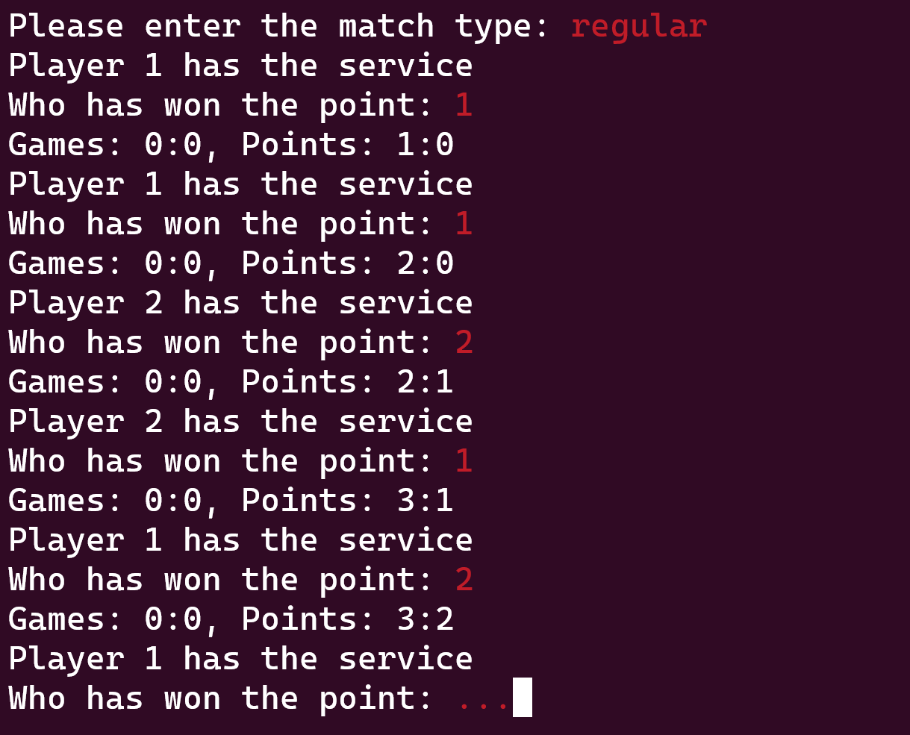
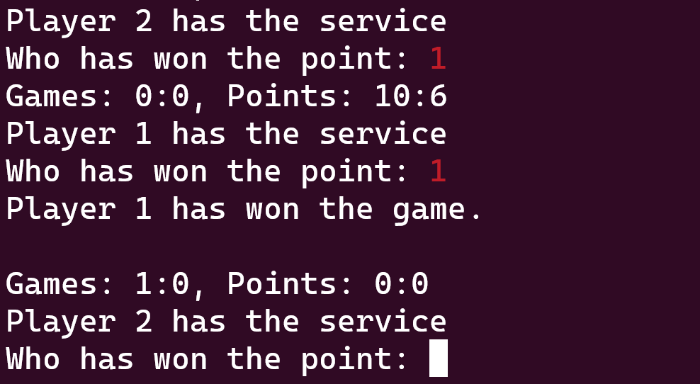
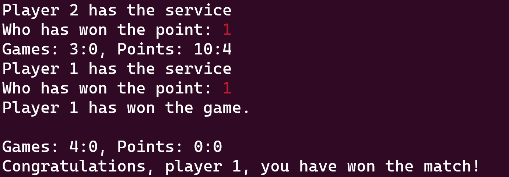

# Ping Pong Counter

## Introduction

A table tennis (aka Ping Pong) club approached you and asked you to build a counter app. It should make counting during matches easier for judges. After each point, a judge enters in your app which player has scored the point. Your app keeps track of the score and notifies the judge whenever a game or when the match has been won.

In our counting app, the player who has the first service is called *player 1*. The other player is called *player 2*.

Note: The counting rules in real table tennis are more complex. In this exam, we implement a simplified counting system (e.g. now deuce).

## Functional Requirements

### Minimum Requirements

You must implement the following requirements in order to reach a positive grade.

* Ask the judge which type of match will be played. The match type determines the number of games played. Judges can enter one of the following options:

  | Input     | Description                                                                                                                          |
  | --------- | ------------------------------------------------------------------------------------------------------------------------------------ |
  | *short*   | Short match that only has a **single game**. Whoever wins that game has won the match.                                               |
  | *regular* | Usually, table tennis matches are *best-of-seven* events. That means that the **winner is the player who has won four games first**. |
  | *double*  | Doubles are usually *best-of-five*. That means that the **winner is the player who has won three games first**.                      |

* After each point, the judge enter *1* if player 1 won the point, or *2* if player 2 won the point.

* The first player who wins 11 points has won the current game. When a player has won a game, your program must print a notification for the judge: *Player 1 has won the game* (if player 1 is the winner of the current game), followed by an empty line. After a player has won a game, the points are reset to 0:0.

* After the judge entered who has won the point, your program must print the current score in games and points. If, for example, player 1 has won no games, player 2 has won one game, player 1 has scored 7 points in the current game, and player two has scored 5 points in the current game, the output would be: *Games: 0:1, Points: 7:5*

* When a player has won enough games to win the match, your program must print the winner: *Congratulations, player 1, you have won the match!* (if player 1 is the winner of the match). After that, your program must exit.

### Additional Requirements

Once you have implemented the minimum requirements, try to add the following program functions. The completeness and correctness of your implementation of these functions will determine your grade.

* In addition to *short*, *regular*, and *double*, judges can also enter the **match type *custom***. If the judge enters *custom*, he can manually enter the number of games that a player must win to become match winner. Your program must only accept an odd number of games that is greater than 0 and lower than 10. If the judge enters an even number or a number outside of the specified range, ask again for the number of games until the judge enters a valid input.

* Before each played point, your program must print which player has the service (e.g. *Player 1 has the service*).
  * At the beginning of each game, your program must randomly select the player who will have the first service of the game.
  * Afterwards, the service changes whenever two points will have been played (i.e. when the sum of the points of both players is an even number). Example: Player 2 was randomly chosen to have the first service. After two points, player 1 has the service. After two additional points, player 2 has the service, etc.

* Sometimes, matches are stopped (e.g. because of an injury of a player). In that case, the judge will enter a *q* (for quit) instead of the player who scored the point. If that happens, exit the program.

## Sample Screen Shots

Here are some sample screenshots of how the user interface should look like. For clarity, user inputs are displayed in red (you do not need to add this coloring to your program).

### Starting a Regular Game

### Winning the First Game

### Winning the Match

