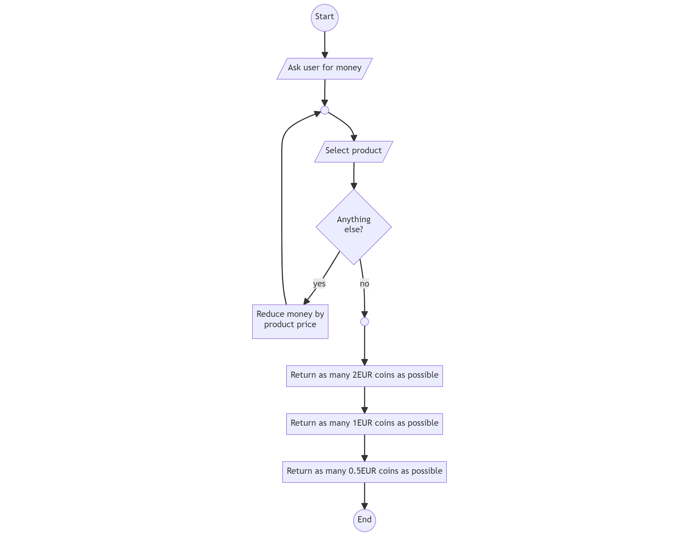

# Coffee Machine

## Introduction

In this exercise, we develop a Coffee Machine simulation. We focus on the credit check and the calculation of the coins that we have to give back to our customers.

Here are the rules how the coffee machine works:

* The user has to enter coins and/or paper money. In real world, we would get the credit amount from a money counting device. In this exercise, we ask the user how much money she provided. The smallest coin our machine accepts is 0.5€. Therefore, the entered amount of money will always be a multiple of 0.5€ (e.g. 2€ and 5.5€ are valid; 7.75€ would not be valid).

* Next, our coffee machine asks the user what products she wants. The following table shows the available products with their prices.
  * The user can choose multiple products one after the other.
  * Before preparing the product, our machine checks if the user has enough money left. If not, an error is printed on the screen.
  * **We ask the user until she tells us that she doesn't want anything else.**

  | Product    | Price |
  | ---------- | ----: |
  | Cappuccino | 3.50€ |
  | Tea        | 1.50€ |
  | Cacao      | 2.50€ |

* Once the user ended the process, we print the remaining money on the screen.

* Finally, we have to calculate how many coins to give back. Our machine can give back 2€ coins, 1€ coins, and 0.50€ coins. We must give back as few coins as possible (i.e. as many 2€ coins as possible, then as many 1€ coins as possible, the rest in 0.50€ coins).
  * Example 1: Remaining money is 5.5€, user gets 2x2€, 1x1€, 1x0.5€
  * Example 2: Remaining money is 1€, user gets 1x1€
  * Example 2: Remaining money is 1.5€, user gets 1x1€, 1x0.5€

## Bonus Requirements

* Beautify the output of your program (e.g. with emojis, colors, etc.)
* Work with the `decimal` data type (which is ideal for money) instead of `double`.
* Check if the amount of money the user entered is a multiple of 0.5€. If not, print an error message and ask again.
* End the product preparation loop automatically if the money left is lower than the cheapest product (tea).

## Extra Bonus Requirement

This is an extra hard bonus requirement for students that already have more programming experience.

Visualize the amount of money left after before each product order. The visualization should be a bar chart consisting of 20 characters. `#` indicates how much money is left from the original credit. `.` represents spent money. The following table illustrates the concept:

| Original Money | Money Left | Bar Chart              |
| -------------: | ---------: | ---------------------- |
|            10€ | 10€ (100%) | `####################` |
|            10€ | 6.5€ (65%) | `#############.......` |
|            10€ |   5€ (50%) | `##########..........` |
|            10€ | 3.5€ (35%) | `#######.............` |
|            10€ |    0€ (0%) | `....................` |

\pagebreak

## Flowchart

Here is the process visualized as a flowchart ([source](https://mermaid.live/edit#pako:eNp9kj1vwjAQhv_KyVMiQYFKLBlagWBshUg74Q7GOSAisSN_DFHEf-9h8xG1iAyO9eZ5fGfHHZO6QJaxvRHNAb4WXAE9uRPGJUl4pWkvg-HwDT60wnYzmtkjeIsGdtpAfc5GPxENQEBXRhdeupXBJkngulQv7VM5VpsRDSgdNDG6rngngvCp3aFU-26m2jDhXGFl8f0U6ctnQqFFG4w1ko-x8ziPLcO2JflSjaqWEi8le8bfrfyrovT9YOZCHnt7vWWBeF16o6kB540CYaEWqqXwew1Sl8qeo0ZbW26raxvBCO7kkTt55k5u7nj6SB6_TJ_pUQr-UhVJQkOasgGr0dSiLOjWdGeQM3fAGjnLaFrgTvjKccbViVDhnc5bJVnmjMcB800hHC5KQfetZtlO0F87_QL6jdJc)):



## Example Output

### A Cappuccino and a Tea

```txt
Please enter the amount of money that you fed into the machine (multiple of 0.5€): 7.5

Which product would you like to buy?
1) Cappuccino (3.5€), 2) Tea (1.5€), 3) Cacao (2.5€), 4) Nothing else
1
Which product would you like to buy?
1) Cappuccino (3.5€), 2) Tea (1.5€), 3) Cacao (2.5€), 4) Nothing else
2
Which product would you like to buy?
1) Cappuccino (3.5€), 2) Tea (1.5€), 3) Cacao (2.5€), 4) Nothing else
4

You get 2.5€ back.
You get 1x2€ pieces
You get 1x0.5€ pieces
```

### Not Enough Money

```txt
Please enter the amount of money that you fed into the machine (multiple of 0.5€): 1.5

Which product would you like to buy?
1) Cappuccino (3.5€), 2) Tea (1.5€), 3) Cacao (2.5€), 4) Nothing else
1
Sorry, you do not have enough credit left
Which product would you like to buy?
1) Cappuccino (3.5€), 2) Tea (1.5€), 3) Cacao (2.5€), 4) Nothing else
4

You get 1.5€ back.
You get 1x1€ pieces
You get 1x0.5€ pieces
```

### Output With Money Bar

```txt
Please enter the amount of money that you fed into the machine (multiple of 0.5€): 10

####################
Which product would you like to buy?
1) Cappuccino (3.5€), 2) Tea (1.5€), 3) Cacao (2.5€), 4) Nothing else
1

#############.......
Which product would you like to buy?
1) Cappuccino (3.5€), 2) Tea (1.5€), 3) Cacao (2.5€), 4) Nothing else
2

##########..........
Which product would you like to buy?
1) Cappuccino (3.5€), 2) Tea (1.5€), 3) Cacao (2.5€), 4) Nothing else
4

You get 5.0€ back.
You get 2x2€ pieces
You get 1x1€ pieces
```
