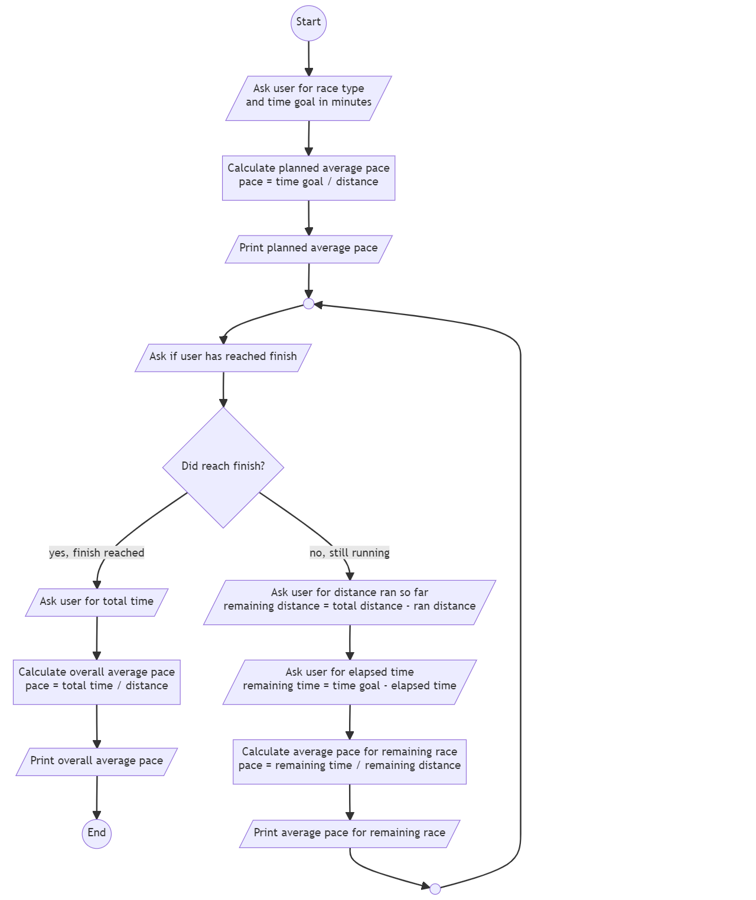

# Marathontrainer

## Einführung

Menschen, die einen Marathon oder Halbmarathon laufen, haben typischerweise ein Zeitziel (z. B. Marathonlauf unter 4 Stunden = 240 Minuten). Beim Laufen messen sie die Zeit pro Kilometer. Sie müssen eine Software schreiben, die LäuferInnen hilft, ihr Zeitziel zu erreichen.

## Anforderungen

Mindestanforderungen:

1. Fragen Sie den/die BenutzerIn zunächst, ob er/sie einen Marathon (42,195 km) oder einen Halbmarathon (21,0975 km) laufen möchte.
2. Als nächstes fragen Sie nach dem Zeitziel in Minuten (z. B. 240 Minuten).
3. Berechnen Sie die erforderliche durchschnittliche Zeit pro km und geben Sie sie auf dem Bildschirm aus.
   1. Beispiel: 240 Minuten für 42,195 km bedeutet 240 / 42,195 = 5,688 Minuten/km (Runden bei der Ausgabe ist nicht notwendig)
4. Während des Laufens kann der/die BenutzerIn eingeben, wie weit er/sie bereits gelaufen und wie viel Zeit bereits verstrichen ist. Daraus muss eine neue km-Zeit errechnet werden. Führen Sie daher die folgenden Schritte in einer Schleife aus:
   1. Fragen Sie den/die BenutzerIn, ob er/sie die Ziellinie bereits erreicht hat. Verlassen Sie die Schleife, wenn sie das Ziel erreicht hat.
   2. Fragen Sie den/die BenutzerIn, wie viele Kilometer bereits gelaufen wurden (z. B. 10)
   3. Fragen Sie den/die BenutzerIn, wie viele Minuten seit dem Start bereits vergangen sind (z. B. 60)
   4. Drucken Sie das erforderliche Durchschnittstempo für den Rest des Rennens aus. In unserem Beispiel verbleiben noch 42,195 - 10 = 32,195 km und 240 - 60 = 180 Minuten. Das neue Durchschnittstempo beträgt also 180 / 32,195 = 5,591 Minuten/km.
5. Fragen Sie die Benutzerin am Ende nach ihrer Gesamtzeit in Minuten. Berechnen Sie die Durschnittsgeschwindigkeit in Minuten/km und geben Sie sie auf dem Bildschirm aus.

Zusätzliche Anforderungen:

* Fügen Sie neben Marathon und Halbmarathon eine dritte Option namens *custom* hinzu. Sie ermöglicht es, die Entfernung manuell einzugeben. Wenn der Benutzer also *custom* auswählt, müssen Sie sie/ihn nach der Entfernung in km fragen.
  * Stellen Sie sicher, dass die eingegebene Entfernung eine positive Zahl kleiner 200 ist. Wenn nicht, fragen Sie erneut, bis der Benutzer eine gültige Zahl eingegeben hat.
* Überprüfen Sie die Entfernungseingabe in der Schleife (Schritt 4.2 oben): Wenn eine Entfernung eingegeben wurde, die größer als die Gesamtentfernung ist (z.B. Eingabe von 50km bei einem Marathon, der nur 42,195km lang ist), geben Sie einen Fehler aus und fragen Sie erneut nach, bis eine gültige Entfernung eingegeben wurde.
* Stand heute kann kein Mensch bei Langstreckenläufen schneller als 2,7 Minuten/km laufen. Wenn das berechnete Tempo in Schritt 3 oben kleiner oder gleich 2,7 Minuten/km ist, geben Sie eine Warnmeldung aus (z. B. *Sie werden nicht so schnell laufen können*). Das Programm soll nicht sofort enden, falls die Warnung ausgegeben wird.

## Flussdiagramm für Mindestanforderungen



[Source](https://mermaid.live/edit#pako:eNqFlE2PmzAQhv_KyCdWIh84CSRIbRU1bS-Vuurm1KUHC0xildjINqumUf57jYm9wKYqB7DH43fsZ2a4oFwUFKXoIEl9hP0u42CeJ02kDgL7eXjo2WAyeQ87pjThOX2ebdUvaBSVUAoJkuQU9LmmWcYJL0CzE4WDIBUwDifGG03V7Gcn5iSs3kdS5dsXKsmBPhqN53beVERTqCvCOS2AdKtQm2Wj3n7gXS_ADIqb4E1_JGnDPErGtQ0ws8O76u6A3tlu_d7wIABHwsys1dz-M-NMHTsQrOxYHIkCSUl-NNKlXXeifoPd3g0vO1Z07jfnD9fO2XvCmarwtuiFW4G90KTaGwijROjWbum4wN7T87aW7cthBFy0KKrqX8C98H3ifdFX5C7Kjfq9EAPqfYFPvAgC83LoX6FwEYLSzAjJhnPGD4PSxCMk7rCmSDkoASWR5lqSngize_26u6Q3TOwWNx3XL-4SYYh8MXU4jkorUivadcIgnEXYL-DJwNenzeneaxPcS1ufZdeLPpQcZHB0hBm8RXC_g_CwhbDL5n8iv2kn7NL6rfwqRN3rKm9zHZdxFKITlUavMH-oS-uWIX2kBiZKzbCgJWkqnaGMX40rabR4OvMcpVo2NERNXRg2O0bMv-2E0pJUylhrwn8IMZij9IJ-o3SxmM7XeBUtFzjG8yTaxCE6o3SC42Qar9fLeBltNmucLK4h-mMlommSRKs4wvFys4mSeL66_gUONMHn)

## Beispiel für Ausgabe/Eingabe

```txt
Distanz? (1) Marathon, (2) Halbmarathon, (3) Benutzerdefiniert 1
Was ist Ihre Zeitziel (in Minuten)? 240
Ihr Durchschnittstempo muss 5,6878777106292215 Minuten/km betragen.

Hast du das Ziel schon erreicht (j/n)? n
Strecke bisher gelaufen? 10
Verstrichene Zeit? 60
Ihr Durchschnittstempo muss 5,59093026867526 Minuten/km betragen.

Hast du das Ziel schon erreicht (j/n)? j

Gesamtzeit? 240
Ihr Durchschnittstempo betrug 5,6878777106292215 Minuten/km.
```
