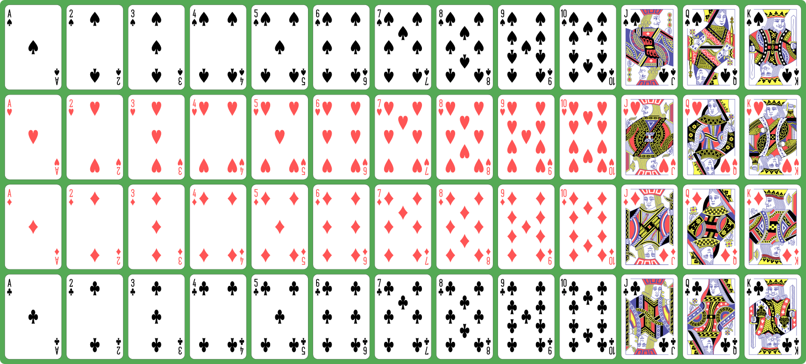

# Blackjack

## Introduction

[Blackjack](https://en.wikipedia.org/wiki/Blackjack) is a popular casino card game. In Europe, the game is often referred to as [*17 und 4*](https://de.wikipedia.org/wiki/Siebzehn_und_Vier).

The game is played with a typical [deck of 52 cards](https://en.wikipedia.org/wiki/Playing_card): Four suits (hearts, tiles, clovers, and pikes), each consisting of 13 cards (Ace, 2, 3, 4, 5, 6, 7, 8, 9, 10, Jack, Queen, and King):



In Blackjack, each card has a value:

* The value of the cards between 2 and 10 is their printed-on value, so e.g. the card 2 has a value of 2.
* Jack, Queen, and King all have a value of 10.
* Ace has a value of 11. However, there are some special rules for Aces which we will discuss later.

Your goal when playing Blackjack is to draw cards until you get as close to a total value of 21, but **not** more than 21. If the total value of your cards is higher than 21, you lose. The best hand of cards in Blackjack is if you get exactly 21 with two cards (i.e. a combination of a card with value 10 plus an Ace). Such a hand is called a *Blackjack*.

In this exercise, we develop a version of a Blackjack tournament with simplified game rules. One player plays against the computer who takes the role of the bank. The player starts with 100€. If the player manages to at least double her money, she wins the tournament. If the player loses all the money, she loses the tournament.

**Important note regarding random cards:** Simulating shuffling of cards and handing out random cards like from a real deck of cards is too complicated for this course. Therefore, you can *simplify the calculation of random cards* in our game. Simply get a random value between e.g. 1 and 13 and assign each of these values to a card (e.g. 1 is Ace, 2 is Two, 3 is Three, ..., 11 is Jack, 12 is Queen, 13 is King). You can ignore suites (hearts, tiles, clovers, and pikes).

## Methods

In your solution, you **must** use methods to structure your code. Here are some suggestions  :

* `InitializeGame`: Called in each round before the player's turn and the computer's turn. Initialize variables (e.g. total card value) in this method.
* `HandoutRandomCard`: Hands out a random card and calculates its value.
* `PrintCard`: Print the handed out card and the total card value on the screen.
* `AskForBet`: Ask user for how much money she wants to bet.

These methods are just suggestions. You can add additional methods if you want.

## Game Rules - Minimum Requirements

1. At the beginning of the tournament, the player has 100€.
2. The game is played in rounds. At the beginning of each round, its **the player's turn**.
   1. The player gets her first, random card. The computer prints the card together with its value on the screen.
   2. After the first card, the player *must* place a bet. The minimum bet is 10€, the maximum bet is the amount of money the player has left.
   3. After placing the bet, the player gets a second card and your program prints the *total* value of the hand on the screen.
   4. The player can now decide, if she wants an additional card. If she does, the new card and the total value of the hand are printed on the screen.
   5. Handing out new cards (step 2.4) stops when the player decides that she doesn't want additional cards or if the cards' total value becomes greater than 21. In the latter case, the player lost the round and therefore has lost her bet.
3. Once the player decided to stop taking card, it's **the computer's turn**.
   1. The computer takes random cards until its total card value is greater than 16.
   2. If the computer's total card value is greater than 21, the player has won the round and gets back double her bet. If she e.g. had 50€ left before the round, has bet 10€ and wins, she will have 60€ at the end of the round.
   3. Otherwise, the computer wins the round if the total card value is greater than the total card value of the player. In that case, the player has lost her bet. If the player's total card value is greater, the player has won the round and gets back double her bet.
   4. If computer and player have the same total card value, we have a *standoff* and the bet is returned to the player.
4. At the end of each round, the system **checks if the tournament has reached its end**.
   1. If the player doesn't have enough money left for the minimum bet, she lost the tournament and the program stops.
   2. If the player has at least doubled the initial money, she has won the tournament and the program stops.
   3. If neither is the case, the next round starts (back to step 2).

To make it easier for you to understand the program logic, here are flowcharts for the player's turn and the computer's turn:

* [Player's turn](https://mermaid.live/edit#pako:eNptUl2P2jAQ_CurfSknhY8ESEh0orr2rupDW1Xlno7wYLBzRA02stft0Yj_XsfJcUCbl3jWM6PZ9da4UVxghs-a7bfweJ9LcN-CmKbvFTsI3eu1_3cGyGp5c_MPA_r9OXwqtaGPTPPlZyY5KEtQNCXYuNqq1Zw4XvFB0HJ4Z35CoTSsBYGVVFa3az2cN6g0IBUBKQWV-g2N6Svels_bYefpXLzbQmyU5JcBjK-dJ3hjedFXpUUDTH3nvLeulYb7_tiST7eOCwdhvOSbeLlqk51JV_9RSuWFD5K342oprz7tKKwhwetHRazyPrfDtZ7_YpUVMIco7AK1tPM0P5SV_IsytOyeonLnALr5NWB1Le3inCK29yejy6y93kPTZeFfZX-9BxjgTugdK7lboLoxytGNYidyzNyRi4LZinLM5dFRmSW1OMgNZqStCNDuOSNxXzK3ejvMClYZV90z-aTUBcasxhfMxuPBaBZNw8k4iqNREqZxgAfM-lGcDOLZbBJPwjSdRcn4GOAfbxEOkiScxmEUT9I0TOLR9PgX7nrwCw)
* [Computer's turn](https://mermaid.live/edit#pako:eNp1k1FvmzAQx7_KyS9NJZIGkpiAqkzaOqkPe5jUapMW-uAEk6Aamxm7Wxbx3WvMDDS0PJ2P8-9__p99RnuRUhSjgyTlER7vEg7me1BEqi-iKLWicjJx0VUFj1ry6-t3qmA63YBbbLusIs-0gj2R6e1O3mw0VzkDJRRh8EKYprABHz-1vBHqs67UeSBu91lOA-wAgf-p7gnNJkOAk9F1oO-MnKj8mfNq24bwR3CQQvPUszw4UFXBjuyfIRV6xygcTdGOqqcxmIuOe58fTN0PwoZdNr1VV647iy-t6MW_Qc8dZ8A37vJUZNkYbZEtnv7WpPHzPZW-rO7mZYkXh-jNGZc5E-_JC3X5rQs8aBWteVbNGvjWueFOi_rKU3eiDwwYT-6bqJSbHDPxcHRGCvLKpgfD6vd9LNof_LJmMjELEFl71wYX8P_tRx4qqCxInpqnc26ICVJHWtAExSZMaUY0UwlKeG1KiVbi4cT3KFZSUw_pMiWK3uXEPLoCxRlhlcmWhP8S4s0axWf0F8WLxWy-Dlb-chHgYB76EfbQCcXTAIczvF4v8dKPonUQLmoP_bMIfxaG_gr7AV5GkR_i-ap-BYIUS0U)

## Advanced Game Rules - Winning with Blackjack

As mentioned before, having a Blackjack (i.e. 21 with two cards) is the highest possible hand. Change the logic of your program as follows:

* If the player gets a Blackjack, she immediately wins the round. The computer does not play in this round because the Blackjack of the player cannot be beaten.
* In the case of winning with a Blackjack, the player gets back her bet with a surplus of her bet * 1.5. If she e.g. had 50€ left before the round, has bet 10€ and wins with a Blackjack, she will have 65€ at the end of the round.
* If the player does not have a Blackjack, but the computer does, the computer wins the round. Even if the player also has a total value of 21 (e.g. with the cards Six, Five, Ten), the computer wins with the Blackjack.

Change your program accordingly.

## Advanced Game Rules - Aces

In real Blackjack, there is a more complex logic for Aces. Each Ace can have a value of 11 **or** 1, whatever is better. Let's look at an example:

* The player has a Ten and a Five.
* Next, he gets an Ace. If the Ace would be counted with a value of 11, the player would have 26 and lose the round. In such a case, the Ace counts only 1. So the total card value is 16.

Here is another example:

* The player has an Ace.
* The player gets another Ace. That would lead to a total value of 22. In that case, one of the Aces counts as 1 and the total card value is 12, not 22.

Change your program accordingly.

## Sample Output 1

Here is a sample tournament. Pay particular attention to the computer's play in Round 1. Here you can see the effect of the advanced Ace game rule (see above). Without the Ace rule, the computer would already have more than 21 after the 3rd card (Ace, 2, and 9 equals 22).

```txt
*** WELCOME TO BLACKJACK ***

You have 100€ in your pocket. Try to double it!
You will lose if you have no money left

*** ROUND 1, you have 100€ left.

You have 5, hand value is 5.
How much do you want to bet? Bet must be >= 10€ and <= 100€. Press Enter for minimal bet. 20
You have King, hand value is 15. Do you want another card? (y/n) y
You have 6, hand value is 21.
Dealer's turn...
Dealer has Ace, hand value is 11.
Dealer has 2, hand value is 13.
Dealer has 9, hand value is 12.
Dealer has 10, hand value is 22.
Dealer busted, you won!

*** ROUND 2, you have 120€ left.

You have 10, hand value is 10.
How much do you want to bet? Bet must be >= 10€ and <= 120€. Press Enter for minimal bet. 50
You have King, hand value is 20. Do you want another card? (y/n) n

Dealer's turn...
Dealer has Ace, hand value is 11.
Dealer has 8, hand value is 19.
You win!

*** ROUND 3, you have 170€ left.

You have 5, hand value is 5.
How much do you want to bet? Bet must be >= 10€ and <= 170€. Press Enter for minimal bet. 
You have Jack, hand value is 15. Do you want another card? (y/n) n

Dealer's turn...
Dealer has 9, hand value is 9.
Dealer has Jack, hand value is 19.
Dealer wins!

*** ROUND 4, you have 160€ left.

You have 7, hand value is 7.
How much do you want to bet? Bet must be >= 10€ and <= 160€. Press Enter for minimal bet. 50
You have 3, hand value is 10. Do you want another card? (y/n) y
You have 10, hand value is 20. Do you want another card? (y/n) n

Dealer's turn...
Dealer has 7, hand value is 7.
Dealer has 2, hand value is 9.
Dealer has 8, hand value is 17.
You win!
You have 210€, you at least doubled your money!
```

## Sample Output 2

Here is a sample tournament. In round 1, the player has a Blackjack and wins instantly (advanced game rules). In round two, the player has 21, but the computer has a Blackjack. Therefore, the computer wins.

```txt
*** WELCOME TO BLACKJACK ***

You have 100€ in your pocket. Try to double it!
You will lose if you have no money left

*** ROUND 1, you have 100€ left.

You have Ace, hand value is 11.
How much do you want to bet? Bet must be >= 10€ and <= 100€. Press Enter for minimal bet. 50
You have Jack, Blackjack! You won with Blackjack!

*** ROUND 2, you have 175.0€ left.

You have 10, hand value is 10.
How much do you want to bet? Bet must be >= 10€ and <= 175.0€. Press Enter for minimal bet. 75
You have 5, hand value is 15. Do you want another card? (y/n) y
You have 6, hand value is 21.
Dealer's turn...
Dealer has Ace, hand value is 11.
Dealer has King, Blackjack!
Dealer won with Blackjack!

*** ROUND 3, you have 100.0€ left.
...
```
