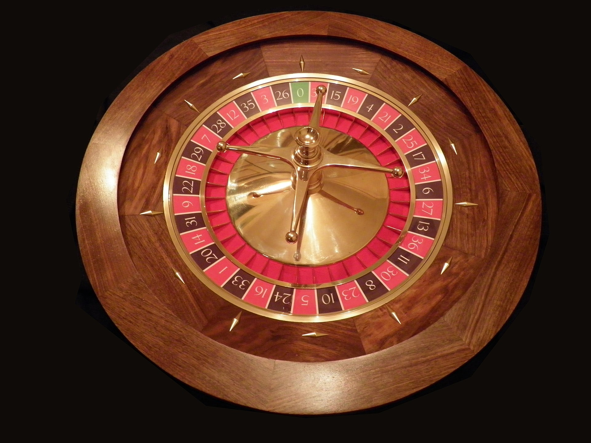

# Roulette

Wir implementieren ein vereinfachtes [*Roulette*]-Casinospiel.



Roulette ist ein Casinospiel, bei dem die Spieler versuchen zu erraten, wo eine Kugel auf einem Rouletterad landet (siehe Bild oben). Das Rouletterad hat 37 Zahlen (0 bis 36). Null ist eine besondere Zahl, sie ist weder rot noch schwarz. Die roten Zahlen sind 32, 19, 21, 25, 34, 27, 36, 30, 23, 5, 16, 1, 14, 9, 18, 7, 12, 3. Alle anderen Zahlen zwischen 1 und 36 sind schwarz.

Der/die SpielerIn in unserem Spiel startet mit 100€. In jeder Runde kann der/die SpielerIn zwischen 10€ und dem Geldbetrag setzen, den der/die SpielerIn aktuell hat. Das Spiel endet, wenn der/die SpielerIn sein/ihr Geld verdoppelt oder so viel Geld verloren hat, dass er/sie nicht genug Geld für den Mindesteinsatz (10€) hat.

## Spielregeln - Mindestanforderungen

Sie müssen die folgenden Anforderungen erfüllen, um diese Prüfung positiv abzuschließen:

1. Zu Beginn des Spiels hat der/die SpielerIn 100€.
2. Das Spiel wird in Runden gespielt.
    1. Zu Beginn jeder Runde kann der/die SpielerIn eingeben, wie viel Geld er/sie setzen möchte.
    2. Als nächstes entscheidet der/die SpielerIn, worauf er/sie wetten möchte. Möglichkeiten sind:
       * *Gerade*: Der/die SpielerIn setzt darauf, dass die Kugel auf einer geraden Zahl landet. Beachten Sie, dass 0 nicht als gerade Zahl zählt.
       * *Ungerade*: Der/die SpielerIn setzt darauf, dass die Kugel auf einer ungeraden Zahl landet. Beachten Sie, dass 0 nicht als gerade Zahl zählt.
       * *Einzeln*: Der/die SpielerIn kann eine einzelne Zahl eingeben, auf der er/sie glaubt, dass der Ball landen wird.
    3. Der Computer errechnet einen zufälligen Wert zwischen 0 und 36 und gibt ihn auf dem Bildschirm aus (in einem echten Casino würde hier die Kugel im Rouletterad rollen).
    4. Der Computer berechnet, ob der/die SpielerIn gewonnen hat.
       * Wenn der/die SpielerIn eine *gerade*- oder *ungerade*-Wette gemacht und gewonnen hat, erhält er/sie das Doppelte seines Einsatzes zurück. Beispiel: Spieler hat 80€, setzt 10€, setzt auf *gerade*, es kommt 12, Spieler hat danach 90€.
       * Wenn der/die SpielerIn eine *Einzelwette* gesetzt und gewonnen hat, erhält er/sie das 36-fache seines Einsatzes zurück.
       * Wenn der/die SpielerIn verliert, ist der Einsatz verloren.
    5. Das Spiel endet, wenn der/die SpielerIn sein/ihr Geld mindestens verdoppelt hat oder nicht mehr genug Geld für den Mindesteinsatz übrig hat.

Sie **müssen** Methoden anwenden, um Ihren Code zu strukturieren und Codeduplizierung zu vermeiden, um die Prüfung zu bestehen. Hier sind einige Vorschläge für Methoden, die Sie in Betracht ziehen könnten:

* `PrintWelcome`: Gibt eine Willkommensnachricht auf dem Bildschirm aus.
* `AskForBetType`: Fragt nach Wettart (gerade/ungerade, Einzelwette) inklusive wettenspezifischer Parameter (bei einer Einzelwette: Die Zahl, auf die der/die SpielerIn sein/ihr Geld setzt).
* `AskForNumber`: Hilfsmethode, die den/die BenutzerIn auffordert, eine Zahl zwischen einem gegebenen Minimum und Maximum einzugeben. Es wird so lange gefragt, bis eine gültige Zahl eingegeben wird.
* `EvaluateResult`: Überprüft, ob der/die BenutzerIn gewonnen hat und berechnet den neuen Geldbetrag, den der/die BenutzerIn nach der Runde hat.

Sie können diese Methoden implementieren, aber Sie dürfen auch weitere hinzufügen und/oder andere implementieren. Beachten Sie jedoch, dass duplizierter Code durch die Verwendung von Methoden vermieden werden muss!

## Spielregeln - Erweitert

Sie können die folgenden Anforderungen umsetzen, um eine bessere Note zu erhalten. Die Note hängt von der Vollständigkeit und Qualität der Umsetzung der folgenden Anforderungen ab:

* Wette auf *Rot*:
  * Der/die SpielerIn kann wetten, dass die Kugel auf einer *roten* Zahl landet. Falls der/die SpielerIn gewinnt, erhält er/sie das Doppelte des Einsatzes zurück.
* Wette auf *Schwarz*:
  * Der/die SpielerIn kann wetten, dass die Kugel auf einer *schwarzen* Zahl landet. Falls der/die SpielerIn gewinnt, erhält er/Sie das Doppelte des Einsatzes zurück.
* *Dutzend* Wette:
  * Der/die SpielerIn kann das Dutzend eingeben, in dem er/sie glaubt, dass die Kugel landen wird (1 für die Zahlen 1 bis 12, 2 für die Zahlen 13 bis 24, 3 für die Zahlen 25 bis 36). Beachten Sie, dass Null von keinem der drei Dutzend abgedeckt wird! Falls der/die SpielerIn gewinnt, bekommt er/sie das Dreifache des Einsatzes zurück.

## Beispielausgabe (inkl. erweiterte Spielregeln)

```txt
*** WELCOME TO ROULETTE! ***

Play until you have lost or doubled your money.

How much money do you want to bet (between 10 and 100)? 10
What do you want to bet on?
1) Even
2) Odd
3) Red
4) Black
5) Dozen bet
6) A single number
1
The random number is 17.
You lost 10€. You now have 90€.

How much money do you want to bet (between 10 and 90)? 20
What do you want to bet on?
1) Even
2) Odd
3) Red
4) Black
5) Dozen bet
6) A single number
3
The random number is 3.
You won 20€! You now have 110€.

How much money do you want to bet (between 10 and 110)? 50
What do you want to bet on?
1) Even
2) Odd
3) Red
4) Black
5) Dozen bet
6) A single number
5
Enter the dozen you want to bet on (1-3)
1
The random number is 14.
You lost 50€. You now have 60€.

How much money do you want to bet (between 10 and 60)? 30
What do you want to bet on?
1) Even
2) Odd
3) Red
4) Black
5) Dozen bet
6) A single number
6
Enter the number you want to bet on (0-36)
0
The random number is 4.
You lost 30€. You now have 30€.

How much money do you want to bet (between 10 and 30)? 40
Invalid input, try again
30
What do you want to bet on?
1) Even
2) Odd
3) Red
4) Black
5) Dozen bet
6) A single number
1
The random number is 7.
You lost 30€. You now have 0€.
```
