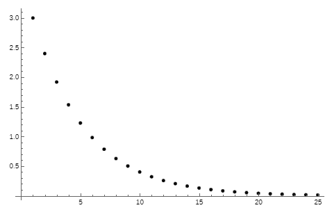

# Methods - Exercises

## Introduction

In order to practice the correct usage of methods, you have to implement the following coding exercises in C#. Add all of them to the attached starter code [Program.cs](Program.cs). The starter code already contains the implementation for *Level 0* for illustration purposes. You have to implement the other methods.

For each method...

* ...add a code region similar to `#region Calculate Circle Area`...`#endregion`
* ...create a `Run...` method (e.g. `RunCalculateCircleArea` for `CalculateCircleArea`, etc.) that asks the user for input parameter, calls the respective method, and prints the result on the screen.
* ...implement the requested method.
* ...try **all** the given test cases to make sure that your implementation works properly.

## Level 0

Write a method `CalculateCircleArea`. It gets the radius of the circle (`double`) as input parameter. It has to return the area of the circle (`double`) as the return value. Here is some test data that you have to use to verify your implementation:

| Radius |      Result |
| -----: | ----------: |
|      1 | 3.14159 (π) |
|      0 |           0 |
|      5 |     78.5398 |

## Level 1

Write a method `RandomInRange`. It gets a minimum value (`int`) and a maximum value (`int`) as input parameters. It has to return a random number between the given minimum (including) and maximum (**including**).

Test test your implementation, call `RandomInRange` 1 million times with minimum 0 and maximum 2. Count how often the result is 0, 1, and 2. Check that all three values occur roughly the same number of times.

## Level 2

Write a method `ToFizzBuzz`. It gets a value (`int`) as input parameter. It returns a `string` containing *Fizz* if the input parameter can be divided by three without a remainder. It returns *Buzz* if divisible by five. It returns *FizzBuzz* if divisible by three and five. Here is some test data that you have to use to verify your implementation:

| Input |   Result |
| ----: | -------: |
|     1 |        1 |
|     3 |     Fizz |
|     5 |     Buzz |
|     9 |     Fizz |
|    10 |     Buzz |
|    15 | FizzBuzz |

## Level 3

Write a method `FibonacciByIndex`. It gets an index (`int`) as input parameter. It returns the index'th element (zero-based) of the [Fibonacci sequence](https://en.wikipedia.org/wiki/Fibonacci_number) (`int`). Here is some test data that you have to use to verify your implementation ([source](https://planetmath.org/listoffibonaccinumbers)):

| Input |      Result |
| ----: | ----------: |
|     0 |           0 |
|     1 |           1 |
|     2 |           1 |
|     3 |           3 |
|    10 |          55 |
|    30 |      514229 |
|    50 | 12586269025 |

## Level 4

Write a method `AskForNumberInRange`. It gets a minimum value (`int`) and a maximum value (`int`) as input parameters. The method asks the user to enter a number between minimum (including) and maximum (including). It keeps asking until the user enters a valid number. The method returns the number the user entered (`int`ä#).

Here is the input/output of the method when called with minimum 5 and maximum 10. You implementation must produce **exactly** that output when the user enters 0, then 11, then 6.

```txt
Please enter a value between 5 and 10
0
Wrong number. Your input is too low. The minimum is 5. Try again!
11
Wrong number. Your input is too high. The maximum is 10. Try again!
6
Thank you, your input is valid.
```

## Level 5

Write a method `IsPalindrome`. It gets a word (`string`) as input parameter. It returns a `bool` value. True is returned if the word is a palindrome (reads the same backwards as forwards), otherwise false. Here is some test data that you have to use to verify your implementation:

| Input   | Result |
| ------- | ------ |
| kayak   | true   |
| deed    | true   |
| rotator | true   |
| noon    | true   |
| racecar | true   |
| csharp  | false  |

## Level 6

Level 5 was too simple for you? Extend `IsPalindrome` so that it ignores spaces, commas, and dashes (*-*) in the input word. Additionally, consider uppercase and lowercase letter to be equal (e.g. *P* and *p* count as equal characters).

| Input                           | Result |
| ------------------------------- | ------ |
| Race Car                        | true   |
| a man, a plan, a canal - Panama | true   |

## Level 7

Write a method `ChartBar`. It gets a value (`double`) as input parameter. It returns an empty `string` if the input value is lower than zero or greater than one. Otherwise, it returns a string that could be used in a chart. The following table illustrates the result for all possible value ranges:

| Value from | Value to | Result for this value range |
| ---------: | -------: | --------------------------- |
|       >= 0 |    < 0.1 | `..........`                |
|      > 0.1 |    < 0.2 | `o.........`                |
|      > 0.2 |    < 0.3 | `oo........`                |
|      > 0.3 |    < 0.4 | `ooo.......`                |
|      > 0.4 |    < 0.5 | `oooo......`                |
|      > 0.5 |    < 0.6 | `ooooo.....`                |
|      > 0.6 |    < 0.7 | `oooooo....`                |
|      > 0.7 |    < 0.8 | `ooooooo...`                |
|      > 0.8 |    < 0.9 | `oooooooo..`                |
|      > 0.9 |      < 1 | `ooooooooo.`                |
|       == 1 |     == 1 | `oooooooooo`                |

## Level 8

Write a method `CountSmilingFaces`. It gets a text (`string`) as input parameter. It returns (`int`) the number of smiling faces (`:-)`) in the input text. Here is some test data that you have to use to verify your implementation:

| Input text     | Result |
| -------------- | -----: |
| `Hello World`  |      0 |
| `:-)`          |      1 |
| `..:-)..`      |      1 |
| `:-):-)`       |      2 |
| `..:-)..:-)..` |      2 |
| `:-):):-)`     |      2 |
| `:-(`          |      0 |

## Level 9

Write a method `HighestInGeometricSequence`. It gets `a` (`double`), `r` (`double`), and `maximum` (`double`) as input parameters. It returns (`double`) the highest element in the following [geometric sequence](https://www.mathsisfun.com/algebra/sequences-sums-geometric.html) that is lower than the `maximum` input parameter:

$\displaystyle\sum_{k=0}^{n - 1} (ar^k) = a + ar + ar^2 + ... + ar^{(n-1)}$

Here is some test data that you have to use to verify your implementation:

|    a |    r |    Maximum |     Result |
| ---: | ---: | ---------: | ---------: |
|   10 |    2 |       1500 |       1280 |
|  0.2 |   50 | 65_000_000 | 62_500_000 |
|    3 |  0.8 |          2 |       1.92 |

Pay particular attention to the last test case. It uses a value of `r` that is &lt; 1. Therefore, the sequence looks like that:


