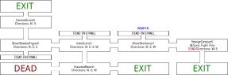

# Text Adventure

## Introduction

Today, we are going to build a simple text adventure game. A text adventure is a type of game in which the player interacts with a virtual world through textual descriptions, using text commands to interact with the game's environment and characters. Typically, the game presents a series of descriptive paragraphs to set the scene, and the player must make decisions and take actions by typing in commands such as "north," "fight," or "talk to the wizard." The game responds with further descriptions of the consequences of the player's actions, and the player continues to explore the game world, solve puzzles, and interact with characters until they reach the end of the game or achieve some other goal. Text adventures were popular in the 1980s and 1990s, but are still played and enjoyed today by fans of interactive storytelling.

Note: This exercise was inspired by [*How to Create a Text Based Adventure Game in Python*](https://www.makeuseof.com/python-text-adventure-game-create/).

## Catacombs of Paris

Our text adventure happens in the catacombs of Paris. Here you see the floor plan of the catacombs that you have to implement in your game:



The catacombs consist of a series of rooms. Rooms are linked through tunnels to the north, east, south, and/or west. The player starts in the *IntroScene* and has to find an *EXIT*. If the player reaches a room marked with *DEAD* or loses against the Goul in the *StrangeCreature*-room, he dies.

## Interactions

### Welcome

The game has to start with the following dialog:

```txt
Welcome to the Adventure Game!
==============================
As an avid traveler, you have decided to visit the Catacombs of Paris.
However, during your exploration, you find yourself lost.
You can choose to walk in multiple directions to find a way out.
Let's start with your name: 
```

Next, the player can enter her name. The program welcomes the player with the message *Good luck, \<name\>*.

### Entering a Room

When the player enters a room, he sees the room message (e.g. *You are at a crossroads, and you can choose to go down any of the four hallways. Where would you like to go?*). Next, the player sees his options (e.g. *Options: north/east/south/west*).

The player can now enter an option. If he enters an invalid option, print *Please enter a valid option.* and ask again until a valid option is entered.

Here are the room messages:

* IntroScene: *You are at a crossroads, and you can choose to go down any of the four hallways. Where would you like to go?*
* ShowShadowFigure: *You see a dark shadowy figure appear in the distance. You are creeped out. Where would you like to go?*
* CameraScene: *You see a camera that has been dropped on the ground. Someone has been here recently. Where would you like to go?*
* HauntedRoom: *You hear strange voices. You think you have awoken some of the dead. Where would you like to go?*
* ShowSkeletons: *You see a wall of skeletons as you walk into the room. Someone is watching you. Where would you like to go?*
* DEAD room west of HauntedRoom: *Multiple Goul-like creatures start emerging as you enter the room. You are killed.*
* StrangeCreature:
  * If Goul is alive: *A strange Goul-like creature has appeared. You can either run or fight it. What would you like to do?*
  * If Goul has already been killed: *You see #the Goul-like creature that you killed earlier. What a relief! Where would you like to go?*

### Player Found Exit

If the player finds an exit, print *You made it! You've found an exit.* and exit the game.

### Player Reaches Dead End

If the player found a dead end, print *You find that this door opens into a wall.*

If the player found the dead end north of *ShowSkeletons* for the first time, print *You find that this door opens into a wall. You open some of the drywall to discover a knife.* After that, the player has the knife in his inventory. The knife is important if the player reaches the *StrangeCreature*-room and decides to fight.

### Fight in *StrangeCreature*-Room

* If the user decides to fight and has a knife: *You kill the Goul with the knife you found earlier.*
* If the user decides to fight and has no knife: *The Goul-like creature has killed you.*
* If the user decides to flee, he is back in the *ShowSkeletons*-room.
* The user can only go south once he killed the Goul.

## Technical Implementation

* Implement a **separate method for each room**.
* Use constants where appropriate.

## Additional Requirements

* Add at least one additional room.
* Hide a second weapon with which the player can kill and survive the Goals in the DEAD room.

## Sample Input/Output

### Killing the Goul

```txt
Welcome to the Adventure Game!
==============================
As an avid traveler, you have decided to visit the Catacombs of Paris.
However, during your exploration, you find yourself lost.
You can choose to walk in multiple directions to find a way out.
Let's start with your name: 
Rainer
Good luck, Rainer.
You are at a crossroads, and you can choose to go down any of the four hallways. Where would you like to go?
Options: north/east/south/west
east
You see a wall of skeletons as you walk into the room. Someone is watching you. Where would you like to go?
Options: north/east/west
east
A strange goul-like creature has appeared. You can either run or fight it. What would you like to do?
Options: flee/fight
flee
You see a wall of skeletons as you walk into the room. Someone is watching you. Where would you like to go?
Options: north/east/west
north
You find that this door opens into a wall. You open some of the drywall to discover a knife.
Options: north/east/west
east
A strange goul-like creature has appeared. You can either run or fight it. What would you like to do?
Options: flee/fight
fight
You kill the goul with the knife you found earlier.
Options: west/south
south
You made it! You've found an exit.
```

### Getting Killed by Gouls

```txt
Welcome to the Adventure Game!
==============================
As an avid traveler, you have decided to visit the Catacombs of Paris.
However, during your exploration, you find yourself lost.
You can choose to walk in multiple directions to find a way out.
Let's start with your name: 
Rainer
Good luck, Rainer.
You are at a crossroads, and you can choose to go down any of the four hallways. Where would you like to go?
Options: north/east/south/west
south
You hear strange voices. You think you have awoken some of the dead. Where would you like to go?
Options: north/east/west
west
Multiple goul-like creatures start emerging as you enter the room. You are killed.
```

### Rush to Exit

```txt
Welcome to the Adventure Game!
==============================
As an avid traveler, you have decided to visit the Catacombs of Paris.
However, during your exploration, you find yourself lost.
You can choose to walk in multiple directions to find a way out.
Let's start with your name: 
Rainer
Good luck, Rainer.
You are at a crossroads, and you can choose to go down any of the four hallways. Where would you like to go?
Options: north/east/south/west
west
You see a dark shadowy figure appear in the distance. You are creeped out. Where would you like to go?
Options: north/east/south
north
You see a camera that has been dropped on the ground. Someone has been here recently. Where would you like to go?
Options: north/south
north
You made it! You've found an exit.
```
