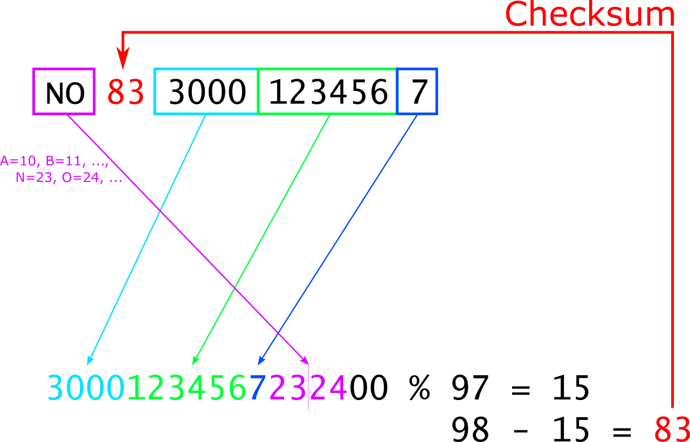
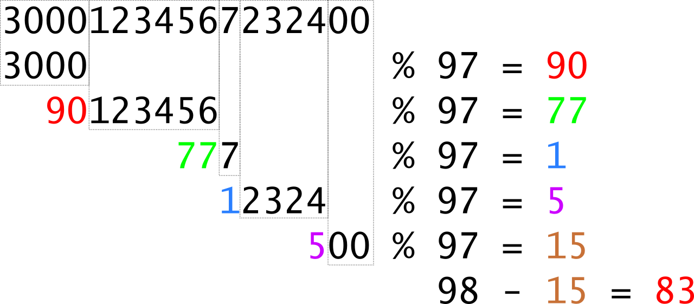
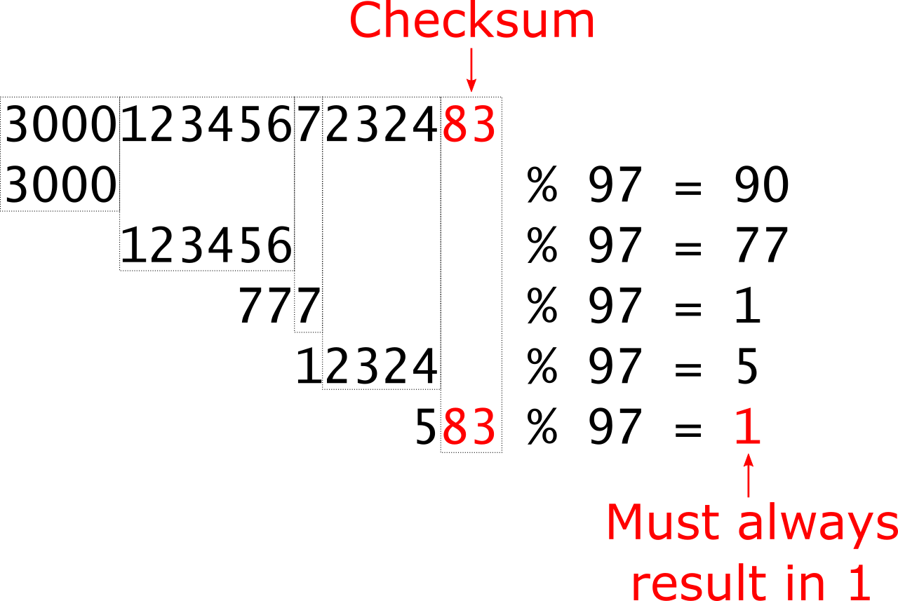

# IBAN Calculator

## Introduction

An **IBAN**, or **International Bank Account Number**, is a unique series of letters and numbers that identifies a specific bank account in international transactions. It is used to make sure that money transfers between banks, especially across different countries, are accurate, secure, and efficient. Essentially, an IBAN helps banks know where to send money when you're making or receiving international payments. You can see IBAN examples from different countries [here](https://www.iban.com/structure).

Your job in today's exercise is to build, analyze, and verify IBANs.

## Level 1 - Build Norwegian IBAN

> In an exam, you must be able to implement level 1 completely to achieve a positive grade.

* Write a command line application that receives the following arguments in the command line:
  * 4-digit Bank code (e.g. *3000*)
  * 6-digit Account number (e.g. *123456*)
* If the command line arguments are invalid, print a meaningful error message (see example below).
* Build the IBAN as shown in the following figure. **Note** that in this level you can set the checksum to *00*. Checksum calculation is part of a later level.
* You **must** write a dedicated method `BuildIban` for building the IBAN from bank code and account number.
* You **can** write additional methods for e.g. checking bank code, checking account number, etc.


Here are some examples for inputs and outputs:

```txt
dotnet run 3000 123456
NO0030001234567

dotnet run
Too few arguments

dotnet run 3000 123456 789
Too many arguments

dotnet run 300A 123456
Bank code must not contain letters

dotnet run 3000 12345A
Account number must not contain letters

dotnet run 300 123456
Bank code has wrong length, must contain 4 digits

dotnet run 3000 12345
Account number has wrong length, must contain 6 digits
```

## Level 2 - Analyze IBAN

* Enhance your command line application from level 1.
* The first command line argument defines the operation. Your app must support two operations:
  * *build*: Contains functionality from level 1
  * *analyze*: New functionality, extracts bank code and account number from IBAN
* If the command line arguments are invalid, print a meaningful error message (see example below).
* You **must** write a dedicated method `AnalyzeIban` for extracting bank code and account number from IBAN.

Here are some examples for inputs and outputs:

```txt
dotnet run build 3000 123456
NO0030001234567

dotnet run print 3000 123456
Invalid command, must be "build" or "analyze"

dotnet run analyze NO0030001234567
Bank code is 3000
Account number is 123456

dotnet run analyze XY0030001234567
Wrong country code, we currently only support "NO"

dotnet run analyze NO0030001234568
Wrong national check digit, we currently only support "7"

dotnet run analyze NO00300012345678
Wrong length of IBAN

dotnet run analyze NO003000123456
Wrong length of IBAN
```

## Level 3 - Calculate Checksum

> In an exam, completing this level correctly would result in a top grade.

* Enhance your command line application from level 2.
* When building an IBAN (command *build*), your application must calculate the checksum. The following image shows how to calculate the checksum.
* **Attention**: When calculating checksums, numbers can become quite large. `int` is not able to handle such large numbers. Use the data type [`long`](https://learn.microsoft.com/en-us/dotnet/csharp/language-reference/language-specification/types#836-integral-types).
* You **must** write a dedicated method `CalculateChecksum` for calculating the checksum.



Here are some examples:

```txt
dotnet run build 3000 123456
NO8330001234567
```

## Level 4 - Stepwise Checksum Calculation

> This level would be too complex and time-consuming for an exam. It is for exercising purposes only.

Norwegian IBAN are comparably short. Austrian or German IBANs are longer. For longer IBANs, the checksum calculation from level 3 has a problem because `long` does not support numbers that long.

To solve this problem, checksum calculation can be done step-by-step.



Change the calculation of the checksum to a stepwise calculation.

## Level 5 - Add Checksum Check

> This level would be too complex and time-consuming for an exam. It is for exercising purposes only.

Extend the *analyze* command so that it verifies the checksum of the IBAN. The following picture illustrates how the verification works:


