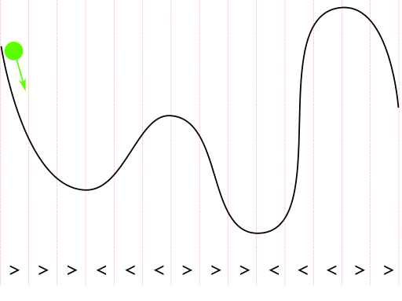
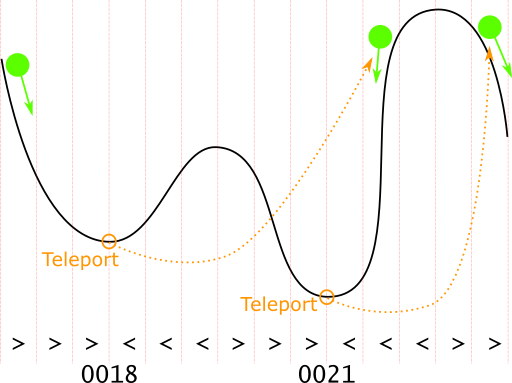

# Magic Marble Run

## Introduction

You have to deal with a *Magic Marble Run*. The following image illustrates how the marbe run works:



Someone built a scanner to digitalize such marble runs. The scanner splits up the run into segments. If the incline in a segment is negative, the scanner reports a `>` character. If it is positive, the scanner reports a `<`. Therefore, the run shown above is represented as `>>><<<>>><<<>>`.

However, the our marble runs are magic. At each sink, the run has a *Teleporter*. It teleports the marble to another segment where it continues its journey.



The scanner identifies teleporters and add their target indexes in the string (i.e. character array) as a four-digit number. Therefore, the run shown above is represented as `>>>0018<<<>>>0021<<<>>`.

```txt
          1         2
0123456789012345678901
----------------------
>>>0018<<<>>>0021<<<>>
   │         │    ▲  ▲
   │         │    │  │
   └─────────┼────┘  │
             │       │
             └───────┘
```

As you can see, when we ad the teleporters to our magic marble run, the marble can start at the very left of the run and exits at the very right.

## Basic Requirements

Write a C# console application that receives a scanned magic marble run as a commend-line argument. You program has to simulate the marble flow and print the following information:

* How many segments does the marble pass while rolling through the run (i.e. how many `>` or `<` characters do you reach in the scanner output)?
* How often is the marble teleported?

Here are some examples. Note that the first example is the marble run shown above.

| Scanned Run                                              | # of Segments | # of Teleports |
| -------------------------------------------------------- | ------------: | -------------: |
| `>>>0018<<<>>>0021<<<>>`                                 |             6 |              2 |
| `>>>>0031<<<>>>0035<<<<>>>>0021<<>>>>`                   |            11 |              3 |
| `>>>>0042<<>>>>0044<<<>>0053<<<<>>>>0018<<<<>>0028<<<>>` |            13 |              5 |

Here are two longer runs. The first one results in 148 segments and 75 teleports:

```txt
>>>>0419<<<>>>0620<<<<>>0146<<<<>>>>0202<<<<>>>0198<<<>>>>0450<<>>>0643<<<>>>>0045<<<<>>>>0655<<<>>0590<<<<>>>0743<<<>>>0144<<>>>>0028<<<>>>0339<<>>>0356<<<<>>0213<<>>0291<<>>0564<<>>0560<<<<>>0124<<>>>>0395<<<<>>>>0549<<<>>0365<<<>>>0263<<<>>>0401<<<>>>>0182<<<>>>0064<<<>>0282<<>>>0062<<<>>>>0506<<<>>>0108<<>>>0230<<<>>>0043<<>>0688<<<<>>>>0441<<>>>0157<<>>0179<<>>>>0098<<<>>>>0663<<<>>>0336<<<>>>>0623<<<>>0574<<>>>0677<<<<>>>0320<<<<>>>0754<<<>>>0435<<<>>>>0301<<>>>>0250<<<<>>0467<<<<>>>>0410<<<<>>>>0386<<<<>>>0074<<>>>0278<<>>0641<<<<>>0088<<>>>0231<<<>>>>0501<<<<>>0717<<>>>>0018<<<<>>>>0610<<>>>0311<<>>>>0471<<<>>>>0708<<<>>>0522<<>>>>0594<<<>>>0534<<>>>>0481<<<<>>>>0705<<<<>>0260<<<<>>0129<<<>>>>0757<<>>>0368<<<>>0532<<<>>>>0733<<>>0165<<<<>>>
```

The second one results in 559 segments and 275 teleports:

```txt
>>>2685<<<<>>>1422<<<>>>2574<<<>>>>2239<<>>1647<<>>1433<<>>>0995<<>>>>0751<<<<>>>>0816<<>>>0436<<<<>>0646<<>>>0721<<<<>>0609<<<>>>1602<<>>1529<<<>>>>2594<<<>>>>1067<<<>>>>1284<<<<>>>>0368<<>>>>2361<<<<>>>0706<<<>>>1903<<<<>>>>0958<<>>>2101<<>>>>2537<<<>>0472<<>>>>1245<<<<>>>>1170<<<>>1796<<>>1459<<>>>>0784<<<<>>>0284<<<>>0047<<<>>>1874<<<>>>>2041<<<>>1718<<<<>>>0128<<<>>>0339<<>>>>0883<<>>>>2378<<<<>>1758<<<<>>>>2313<<<>>>0594<<<<>>>2553<<<<>>1687<<<>>>0268<<>>>>1423<<<<>>>1462<<>>0536<<<>>>>2077<<<<>>>>0358<<<<>>1213<<>>>2397<<<>>>>0565<<>>>>0445<<>>0455<<<<>>>2120<<<<>>>2457<<>>2223<<<<>>>>0834<<<<>>>>2635<<>>>1842<<<>>>1774<<<<>>>1371<<<<>>>1611<<<>>2488<<>>>1825<<<<>>>>1079<<>>2564<<<<>>>>0680<<<<>>>1884<<<>>0425<<>>0252<<<<>>>>2791<<<<>>>1335<<<>>>>1562<<<<>>>>2232<<<<>>>>1114<<<>>>>1907<<<<>>1794<<<>>>>1539<<>>2765<<<<>>>>0975<<<<>>>0210<<<<>>>>0191<<<>>>2783<<<<>>>0771<<>>1004<<>>>>0814<<<>>>2671<<<>>0966<<>>>2745<<<>>2632<<<<>>>>0869<<<<>>2734<<>>>2201<<>>>0900<<<>>>>0220<<>>>>1976<<>>>1729<<<<>>0312<<<<>>>0274<<>>>1050<<<<>>>>2011<<<<>>>1216<<>>0390<<<<>>2408<<>>1296<<>>>1509<<<<>>0492<<>>2620<<>>>0920<<<<>>0029<<>>>>1853<<>>>0301<<<<>>>>0297<<<<>>1357<<<>>>1036<<<<>>>>0597<<<>>>>1346<<>>>1148<<<>>>>0483<<<<>>>>2088<<<>>>>2140<<>>>1949<<<>>>>2729<<>>1139<<<>>0943<<<>>>1179<<>>>0651<<<>>>2528<<>>>0157<<<>>>0057<<<<>>>>1105<<<<>>0846<<<>>0736<<>>1077<<<>>>>2069<<<>>2171<<>>>>2161<<<>>>0075<<<<>>0514<<>>>>1750<<<<>>1706<<>>>>1657<<>>2261<<<<>>>1815<<<<>>>0625<<<>>0911<<>>>2712<<<<>>>>2656<<<>>>2435<<<<>>1268<<<>>>0738<<<<>>>>1574<<>>>>1680<<<<>>2318<<<>>>>1845<<<>>>2485<<>>1660<<<<>>>>1492<<<<>>>>0109<<<<>>>>2245<<>>>0635<<<>>>>0137<<<<>>>>2213<<<>>2406<<>>0327<<<<>>>0349<<>>>>0857<<<<>>>0090<<>>>>1576<<<<>>>>2500<<<>>0555<<>>>>2032<<<<>>>>1250<<<<>>>1304<<<<>>>2350<<<>>>>1224<<<>>0119<<<>>2754<<<>>>1478<<>>>1543<<<>>1394<<<<>>>0019<<<<>>1816<<<<>>>>0665<<<>>>1930<<>>>>1944<<<<>>>>0667<<<>>>>2334<<<>>2030<<<<>>>0872<<<>>>1121<<<<>>1768<<<<>>>>0223<<>>>>0382<<<>>>>1924<<>>>>2515<<>>>>1586<<<>>>0696<<>>>>1872<<>>1965<<<<>>>0176<<<<>>2290<<>>>>0805<<<>>>>0710<<<<>>>0929<<<>>2172<<<>>>>2602<<<<>>>0414<<<>>>1014<<<<>>>0181<<<>>0896<<>>>>2009<<<>>>2152<<<>>>>0553<<<>>1635<<<<>>>>0155<<<>>0106<<>>1392<<<<>>>>1315<<>>2646<<<>>>2702<<>>>>1514<<<>>>>0378<<>>>>0240<<<>>>>0410<<<<>>>>0781<<<<>>>2271<<<>>>>1184<<<<>>>>2689<<>>>>0078<<<>>>1266<<<>>2443<<>>>>1325<<>>>>1150<<>>1195<<>>1096<<<<>>>1087<<<>>>1034<<>>>2477<<<>>>>1482<<<<>>>>0050<<<>>1017<<<<>>2339<<<<>>>0032<<<>>2059<<<>>>1727<<>>>0523<<>>>>2447<<<>>>1616<<<<>>2587<<>>>1379<<<<>>0578<<>>>>1982<<>>2104<<>>>>0493<<>>>>2524<<>>>>2795<<<>>>2263<<<<>>>2124<<<<>>0526<<<>>>1990<<<<>>>>1402<<<<>>>>2292<<<<>>>>1286<<<<>>>>2192<<<>>>2425<<<<>>>0976<<>>>>1696<<<>>>2381<<<<>>0243<<<<>>>>2582<<>>1443<<<<>>
```

## Advanced Requirements

After carefully analyzing the scanner results, you recognize that the scanner sometimes reports the teleport target index as a *hexadecimal number* (e.g. `0x002b`). Change your program so that it can handle hexadecimal values, too.

Here are some examples. Note that the first example is the marble run shown above.

| Scanned Run                                                       | # of Segments | # of Teleports |
| ----------------------------------------------------------------- | ------------: | -------------: |
| `>>>0x0014<<<>>>0023<<<>>`                                        |             6 |              2 |
| `>>>>0028<<<>>0031<<<>>>0012<<<>>`                                |             8 |              3 |
| `>>>0x0015<<<<>>>>0026<<<>>>>0x002e<<>>>>0048<<<<>>0x003e<<<>>>>` |            12 |              5 |

Here are two longer runs. The first one results in 164 segments and 75 teleports:

```txt
>>>>0x01d1<<>>>>0x01b9<<<<>>>>0314<<>>>>0x0223<<<>>0x016a<<<<>>>>0x0149<<<<>>0476<<<>>>>0705<<>>>0767<<<>>0843<<<>>>>0x00f4<<<<>>>0219<<>>0x032b<<>>>>0x00a0<<<<>>0x02a8<<<>>>>0x00fe<<<<>>0268<<<<>>>0x0288<<>>>>0x018f<<<<>>>>0x0088<<<<>>>>0x02ec<<>>0x001b<<<>>>>0661<<<<>>0x00cd<<<<>>>0617<<<<>>>>0x0024<<>>>>0462<<>>>>0x02b3<<<<>>>>0x01f9<<<<>>>0629<<<<>>>0x0205<<>>>0104<<<>>0x00ad<<<<>>>0x0216<<>>>0x0123<<>>>>0x004b<<<<>>0157<<<>>0423<<>>>0x02de<<<<>>>>0x022c<<<>>>0x023e<<>>0796<<>>>>0x007b<<>>0809<<<<>>>>0x01b0<<<<>>>>0x0117<<>>>>0x02b9<<>>>>0x0240<<>>0839<<<>>0x003d<<>>>0x0183<<<<>>0x005d<<<>>>>0102<<>>0588<<<>>0365<<<>>>>0x0337<<>>0127<<<<>>0x00ba<<<<>>>>0618<<<>>0303<<<<>>>0x00e6<<<>>>>0607<<>>0x003b<<>>>0778<<>>>>0x01e6<<<<>>0x015f<<>>>0x0131<<<<>>0787<<>>>0x01a5<<<>>0737<<>>0x0294<<>>>>0x0017<<<>>0x02d1<<<<>>0x017e<<>>0530<<>>>
```

The second one results in 552 segments and 275 teleports:

```txt
>>0x0b18<<>>0x080f<<>>>2123<<<>>0359<<<>>0x0518<<>>>0x0249<<<<>>0x03c5<<<<>>1042<<<>>>1421<<>>>>0x06e0<<<<>>0784<<<<>>>2189<<<>>0404<<<>>>>1065<<<>>>>1400<<>>>>0x0371<<>>0x0635<<<<>>2765<<<>>>>0105<<>>2024<<>>>0x01bf<<<>>>>1645<<>>>>1939<<<>>>>2415<<<>>0029<<<>>>>0x03a4<<>>>>2836<<<>>0x00cf<<<<>>>0x043f<<>>>>2086<<<>>>2010<<>>0x0983<<<>>>0x0226<<<<>>1192<<<<>>1614<<>>>0x0b5f<<<<>>2247<<<>>>>0x017b<<<>>0968<<<<>>>0x01ef<<>>>>2395<<<<>>>0x03f3<<<<>>>>0x03ba<<<<>>>>0x0a26<<<>>>1077<<>>>0x00bc<<>>>0x079d<<>>>0847<<<>>0x0684<<<>>0x0627<<<>>>>0324<<<>>>0x0420<<<<>>0x0940<<<>>>>0x0640<<>>>1292<<<<>>>>0x00fb<<<<>>0x023d<<>>>0x0399<<>>>>0751<<<>>2377<<<<>>>>0x04ab<<>>0x045d<<<<>>>0x0563<<<<>>>0305<<>>>2453<<<>>>0818<<>>>>1216<<<>>0x032d<<>>0x02fa<<>>>>0261<<<<>>1897<<<>>>2285<<<<>>>>2497<<<<>>>>0651<<<<>>0x0304<<>>>>1448<<>>>>0425<<<>>1858<<<<>>>1440<<<<>>1679<<<>>>0x0610<<<<>>>2729<<<>>>>0x0186<<<<>>0x03f6<<<>>2632<<>>>0031<<>>0x09f6<<<<>>>>0x086f<<<>>0x0607<<<<>>0x0863<<<<>>>0x00bf<<<>>2526<<<>>>>0x0a7b<<<>>>0339<<<>>1900<<<>>0x009b<<<<>>>0x05f2<<<>>>>1928<<>>>0x0084<<<>>>0361<<>>2949<<>>>0707<<<>>>2746<<<<>>0x0af6<<<<>>>>1495<<<>>2338<<<<>>0x0531<<>>>0476<<<<>>>>1475<<>>>>2976<<<<>>>0x06f7<<<>>1513<<<>>>>1835<<>>0x005a<<<>>>>2663<<>>>0x0680<<<<>>>>0686<<<>>>0x06ba<<<<>>>>1881<<<>>>>0x05f4<<>>>>2334<<<>>>>1983<<<<>>>>0x009d<<<<>>>>0x0b0a<<<>>>2596<<<<>>>>2942<<<<>>>0x06a4<<>>>>0x017d<<>>>2506<<>>>1234<<<>>>0929<<>>>2427<<<<>>2792<<>>>0106<<>>>>0450<<>>>0858<<>>0177<<<>>0414<<<<>>2288<<<>>>>1353<<<>>2052<<<>>0507<<<<>>>1088<<<<>>1993<<<<>>>>0x066c<<>>>0465<<<>>>>1131<<<>>>>0x051a<<>>>>0x0b54<<<>>>0x01f9<<<>>>>2863<<<>>1870<<<>>0x061e<<>>0710<<<<>>>>0x00f3<<<>>>2870<<>>0x02da<<<>>>>0990<<<<>>>>0x0557<<>>>0x0362<<<>>0x0a84<<<>>>0x04bb<<<>>>>2073<<>>>>0x0321<<<<>>>0x0387<<<<>>>1735<<<>>>0739<<>>>>0080<<<>>>>0x007c<<>>>>1113<<<>>>2187<<<>>0x0408<<>>>>0x08a7<<>>>>1158<<<<>>2275<<>>0x09f7<<>>0x04ea<<<<>>>2107<<>>0x0a50<<>>>0x04e9<<<>>>>0x065a<<<>>2735<<>>>>0834<<<>>0x02a2<<<>>0642<<>>0843<<<>>>>1243<<<>>>1098<<<<>>0527<<<>>>>2145<<>>>>1821<<<<>>>2768<<<<>>>0x05b9<<>>0586<<<<>>>>0x08b4<<<<>>>0x05d6<<<<>>>>0x08cf<<<>>0238<<<>>0x08d1<<<<>>1801<<<>>>0x0b9c<<>>0x0090<<<>>0x0b8d<<<<>>0x03e7<<<<>>>>0x058b<<<<>>0x0775<<<>>2565<<<<>>2177<<>>>>1579<<<>>>0274<<>>>0x07e4<<>>0620<<<>>0x003e<<<<>>>0x0856<<>>2709<<>>>0018<<<>>2493<<<<>>>1167<<<<>>>2618<<<<>>>>0726<<<<>>>>0x04f7<<<>>>0623<<<>>>>0x07cb<<<>>2319<<>>>2859<<>>>>1812<<<>>0598<<>>>0x0b61<<<<>>>1845<<<>>2093<<>>0x0581<<<<>>2576<<<>>>>0051<<<>>>2391<<<<>>0x0ae6<<<<>>>>0891<<<<>>>0x0a66<<<<>>>2878<<<<>>>>0x0223<<<<>>>0536<<>>>>0691<<<>>>1318<<<>>>>2356<<<<>>2535<<<>>0x047c<<<>>0x06f4<<<<>>0x06db<<<>>0227<<>>1363<<<<>>>2629<<>>>>1972<<>>>>0x0b72<<>>2721<<<<>>>0x0496<<<<>>0x0697<<>>0x0900<<<<>>0x011c<<<<>>>0x0595<<<>>0x0904<<<<>>>>0x07aa<<>>0x073e<<<>>>>2423<<<<>>0x028e<<>>>0x08a4<<>>>>0335<<>>1477<<>>>0x06b9<<<>>>0x09ad<<<>>>2675<<<>>>2035<<<>>>>0306<<<<>>>>0048<<<<>>>>0205<<>>2445<<>>2467<<<>>>>
```

## Even More Advanced Requirements

**Note** that this part of the exercise is much harder than the ones before.

You recognize that the scanner sometimes has read errors. It reports back runs with endless loops in them, i.e. runs where the marble never reaches the exit at the right. Here is an example:

```txt
>>0020<<>>>>0x0016<<>>>>0037<<>>>0x002a<<<>>>>0017<<<>>
```

Write a method `IsValidMarbleRun` that returns `false` if the marble run contains an endless loop. If it does, print a meaningful error message on the screen.
